<div align="center">


# Ledger

**Change memory that lives in your repository.**

Every change leaves a receipt: what changed, why, what must stay true, and how it was verified.<br>
Coding agents write receipts as they work and read them before they touch the code again.

<a href="https://www.npmjs.com/package/@kylebegeman/ledger"></a>
<a href="https://github.com/kylebegeman/ledger/actions/workflows/ci.yml?query=branch%3Amaster"></a>

<a href="./LICENSE"></a>

[Quick start](#quick-start) · [How it works](#how-it-works) · [What agents see](#what-your-agent-sees) · [The reader](#the-reader) · [In CI](#in-ci) · [Commands](#commands) · [Docs](#docs)

</div>

<br>

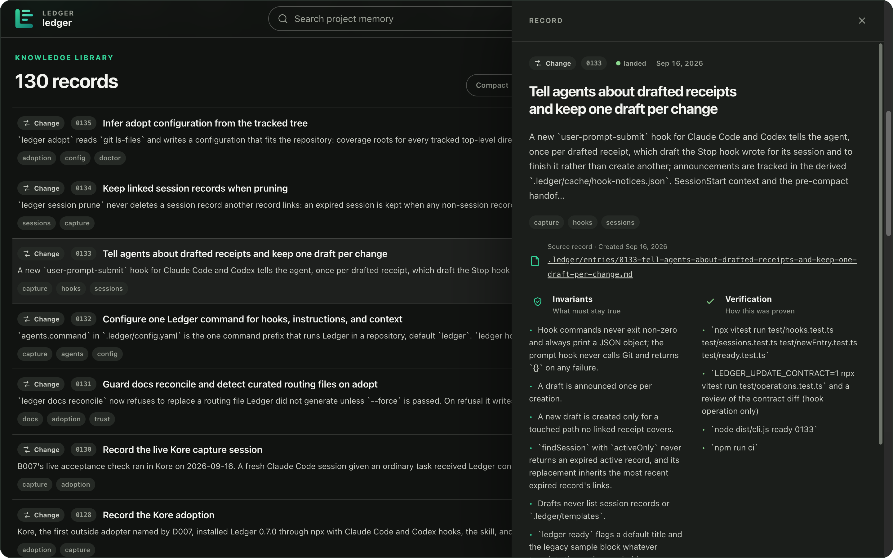

## Why Ledger

Git records what changed. It cannot tell the next person why the retry limit
is five, which invariant a refactor has to keep, or how anyone knew the fix
worked. Coding agents feel this most: every session starts from nothing, so
constraints get rediscovered by breaking them.

Ledger keeps that knowledge in the repository as Markdown under `.ledger/`,
and wires it into the tools that change code.

<table>
<tr>
<td width="33%" valign="top">

**Written while you work**

Hooks for Claude Code, Codex, and Cursor record the files an agent edits and
draft a receipt when its turn ends. In Claude Code and Codex, the next prompt
tells the agent to finish it; a Cursor agent hears about it when its next
session starts.

</td>
<td width="33%" valign="top">

**Read before editing**

`ledger packet <file>` hands an agent the invariants, conflict rules, and
verification for the code it is about to change. `--budget` trims it to a
token budget.

</td>
<td width="33%" valign="top">

**Checked in pull requests**

`ledger ci` fails a pull request whose changed source has no receipt, and
with `--github` it annotates the pull request.

</td>
</tr>
</table>

Nothing is hosted. Receipts are plain Markdown with YAML frontmatter, reviewed
in pull requests like the code they describe, and rendered into a static reader
you can host anywhere or open from disk.

## How it works

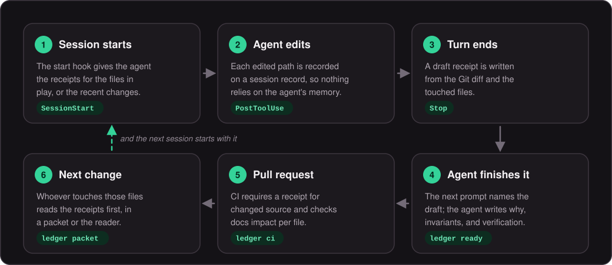

## What your agent sees

These are real outputs from a small billing service with two receipts. When a
Claude Code, Codex, or Cursor session starts while `src/billing/webhooks.ts`
has uncommitted changes, the agent's context opens with the rules that file has
to keep:

<p align="center">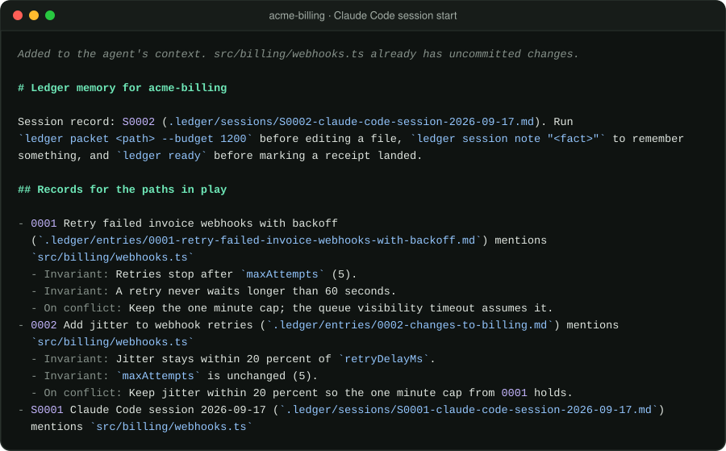</p>

When the turn ends, the Stop hook drafts a receipt from the Git diff and the
files the agent touched. The next prompt names that draft once, so the agent
finishes it instead of starting another:

<p align="center">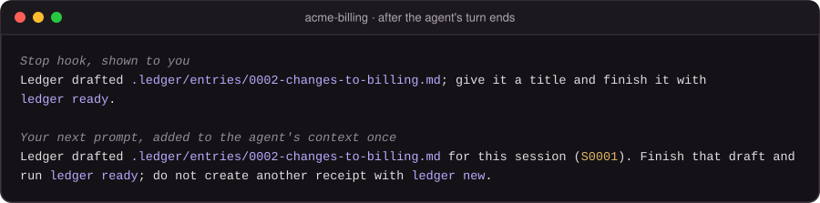</p>

The draft's symbols and anchors come from the lines the diff changed. If the
agent runs `ledger ci` before its turn ends, the report lists the files still
uncovered and names the session whose hook will draft their receipt, so the
agent keeps working instead of writing a second one.

`ledger ready` fails on a draft until its placeholders and TODOs are replaced.
`ledger ci` does not run it, so run it before marking a receipt landed:

<p align="center">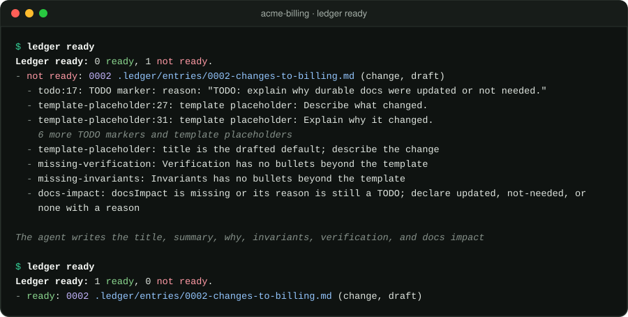</p>

Before editing a file, an agent pulls every receipt that touches it:

<p align="center">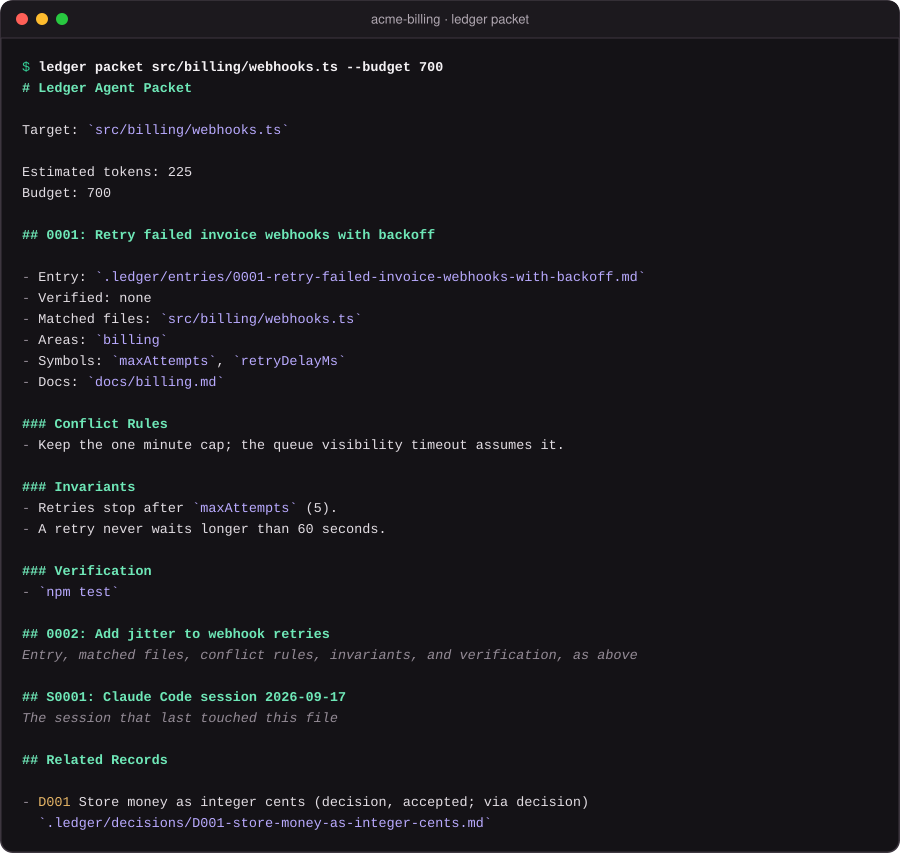</p>

The full hook lifecycle, including compaction handoffs and sessions whose host
never reported an exit, is in [docs/ARCHITECTURE.md](./docs/ARCHITECTURE.md).

## A receipt

A receipt is a change entry: a Markdown file whose frontmatter links it to
files, symbols, docs, and decisions, and whose sections tell a future change
what to preserve. This is the first receipt from the billing service, as the
reader shows it:

<p align="center">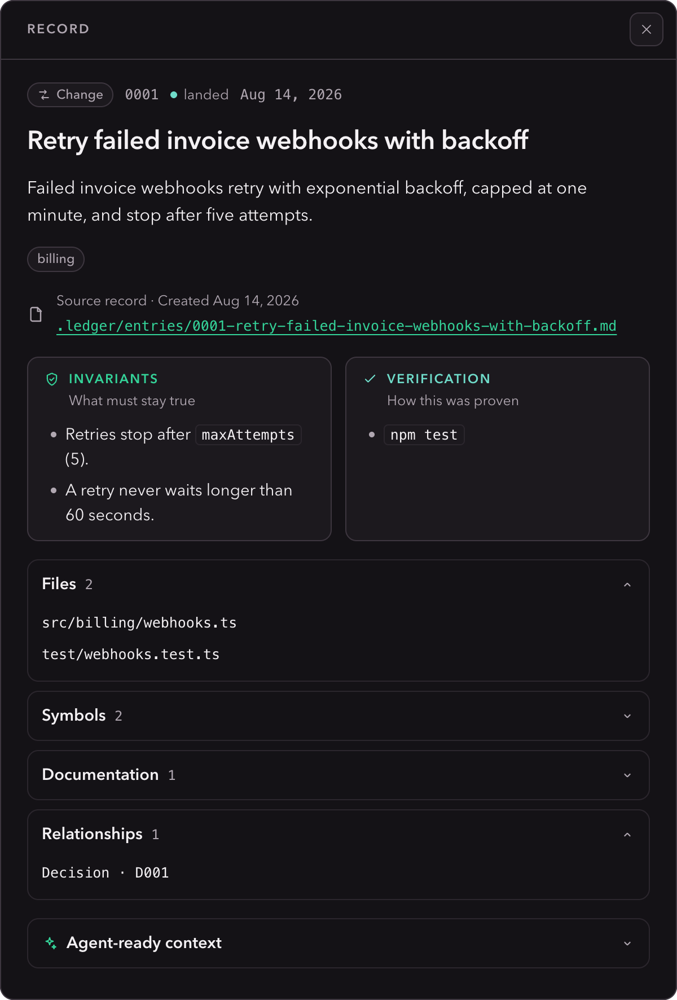</p>

<details>
<summary><strong>The Markdown behind it</strong></summary>

```markdown
---
id: "0001"
kind: "change"
title: "Retry failed invoice webhooks with backoff"
date: "2026-08-14"
updated: "2026-08-14"
status: "landed"
areas:
  - "billing"
files:
  - "src/billing/webhooks.ts"
  - "test/webhooks.test.ts"
symbols:
  - "maxAttempts"
  - "retryDelayMs"
docs:
  - "docs/billing.md"
docsImpact:
  status: "updated"
  reason: "The billing doc explains webhook retries."
  docs:
    - "docs/billing.md"
decisions:
  - "D001"
---

# 0001: Retry Failed Invoice Webhooks With Backoff

## Summary

Failed invoice webhooks retry with exponential backoff, capped at one minute,
and stop after five attempts.

## Why

Customers missed invoice events when their endpoint restarted during a deploy.

## Changed Files

### src/billing/webhooks.ts

- What changed: `maxAttempts` and `retryDelayMs` schedule the retries.
- Anchor: `retryDelayMs`
- On conflict: Keep the one minute cap; the queue visibility timeout assumes it.

### test/webhooks.test.ts

- What changed: pins the attempt limit and the cap.
- Anchor: `caps retries`
- On conflict: Update the test only with a receipt that changes the limit.

## Behavior And UX Impact

A receiving endpoint that is down for under four minutes still gets every event.

## Invariants

- Retries stop after `maxAttempts` (5).
- A retry never waits longer than 60 seconds.

## Verification

- `npm test`

## Notes

The queue visibility timeout is 90 seconds.
```

</details>

## Quick start

Ledger needs Node 22 or newer.

### In a Node project

```bash
npm install --save-dev @kylebegeman/ledger
npx ledger init --with-docs
npx ledger hooks install --host claude-code --command "npx ledger" --import-agents
npx ledger skills install
npx ledger agents --write
```

Then start a Claude Code session and work as usual.

- `init` writes `.ledger/` with its templates and adds a marked `.gitignore`
  block for derived files.
- `hooks install` saves the command in `.ledger/config.yaml`, so the hooks,
  the `AGENTS.md` block, the skill, and the session context all use it.
  `--import-agents` makes Claude Code read `AGENTS.md`.
- For Codex, install with `--host codex`, then trust the hooks with `/hooks`
  in the Codex CLI or on the Hooks page of the Codex app's settings. Trust
  them again whenever the hook commands change, such as a new pinned version,
  because Codex skips a changed hook until then. For Cursor, use
  `--host cursor`.

### In any other repository

Run the published package through npx, pinned to a version, so an agent never
reaches a different program named `ledger` on its `PATH`:

```bash
npx --yes @kylebegeman/ledger@0.9.0 adopt
npx --yes @kylebegeman/ledger@0.9.0 hooks install --host claude-code \
  --command "npx --yes @kylebegeman/ledger@0.9.0" --import-agents
npx --yes @kylebegeman/ledger@0.9.0 skills install
npx --yes @kylebegeman/ledger@0.9.0 agents --write
```

`adopt` reads the tracked tree and writes a configuration that fits it: which
paths need receipts, which generated code to ignore, and a proposed list of
checks `ledger verify --run` may execute. It leaves hand-written docs routing
files alone.

<p align="center">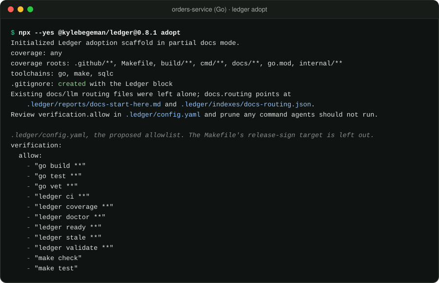</p>

Starting the pinned package through npx costs about 0.3 seconds per hook. On
an Apple silicon Mac, a PostToolUse hook took 0.47 seconds through npx and
0.17 seconds from an installed copy. The first call after a version change
also downloads the package. On a machine where no other program is named
`ledger`, `npm install --global @kylebegeman/ledger@0.9.0` and
`--command ledger` save that time. The hooks are committed, though, so every
contributor then needs the same install. The npx pin works on any machine
with Node.

### Without hooks

Everything the hooks do is a command you can run yourself:

```bash
ledger new "Add jitter to webhook retries" --from-diff --area billing
ledger ready
ledger ci
```

## The reader

`ledger render` builds a static reader from the same Markdown, with filters for
kind, status, area, release, and tags, a detail panel for every record, and
light and dark themes. Served over HTTP, from any static host or
`ledger serve`, it ranks search results with fuzzy matching. Opened from a
`file:` URL, it falls back to plain text matching.

<p align="center">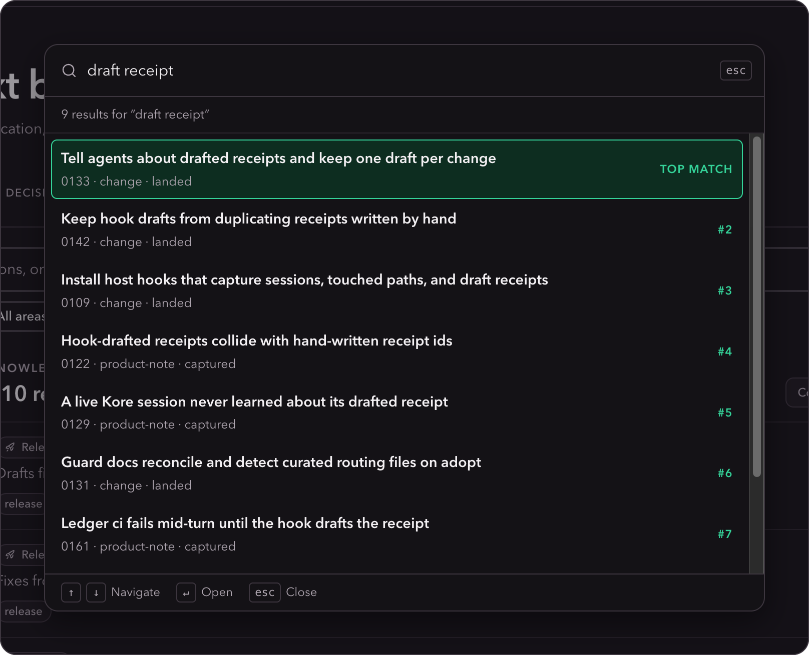</p>

```bash
ledger render                    # writes .ledger/dist/index.html
ledger serve --watch             # serves it on loopback and rebuilds as records change
ledger serve --api               # also reloads open pages and adds a JSON API and MCP
ledger render --profile public   # a public changelog from released notes only
```

The public profile turns release records into a changelog. It is fail-closed:
only released versions and their Public Notes are included, and paths, files,
symbols, invariants, and internal links are stripped.

<p align="center">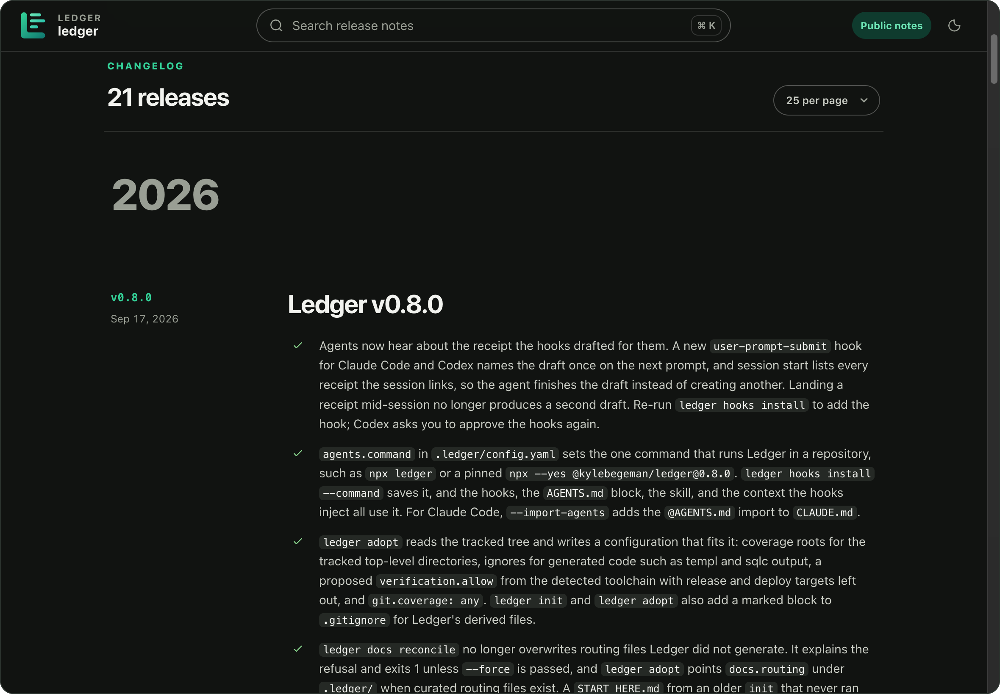</p>

## In CI

Add the action to a pull request workflow. It validates every record, audits
docs, checks coverage and docs impact for the pull request's range, annotates
the pull request, and writes a job summary.

```yaml
name: ledger
on: pull_request
jobs:
  ledger:
    runs-on: ubuntu-latest
    permissions:
      contents: read
    steps:
      - uses: actions/checkout@v6
        with:
          fetch-depth: 0
      - uses: kylebegeman/ledger@v0.9.0
        with:
          command: npx --yes @kylebegeman/ledger@0.9.0
```

The action runs the latest published CLI unless `command` pins it. Set
`comment: "true"` to keep the summary in one pull request comment that every
run updates. It needs `pull-requests: write`, and pull requests from forks,
whose token cannot write, get a notice instead.

<p align="center">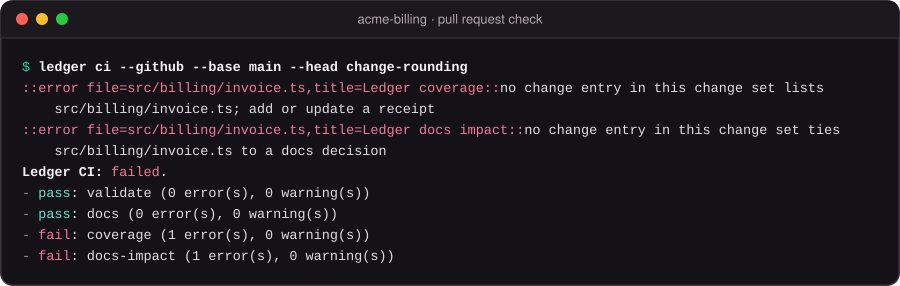</p>

Coverage defaults to `current`: a changed path under `git.requireEntryFor`
needs a change entry in the same pull request. `adopt` writes `any`, which
also accepts an earlier receipt that names the file, for both coverage and docs
impact, so history does not block the first pull requests. A broad pattern such
as `src/**` counts only in a receipt in the pull request, and a file no receipt
names still fails.

## Records

| Record | Created by | Use it for |
| --- | --- | --- |
| **Change entry**<br>`.ledger/entries/` | hooks, `ledger new` | A receipt for one change: why, invariants, verification, and conflict rules |
| **Product note**<br>`.ledger/entries/` | `ledger feedback` | Dogfood findings and product observations |
| **Backlog item**<br>`.ledger/backlog/` | `ledger backlog new` | Planned work with acceptance checks; `ledger promote` turns it into a change entry |
| **Decision**<br>`.ledger/decisions/` | `ledger decision new` | An architecture or product decision and when to revisit it |
| **Release**<br>`.ledger/releases/` | `ledger release` | The receipts in a version and the public notes for GitHub Releases |
| **Session**<br>`.ledger/sessions/` | hooks, `ledger session start` | What one agent session touched and learned; after it expires, `ledger session prune --write` deletes it unless it was promoted or another record links it |

Records, and the verification evidence in `.ledger/reports/evidence.json`, are
committed with the code. Indexes, Markdown reports, caches, and the rendered
reader are derived and git-ignored. Record fields and sections are documented
in [docs/SCHEMA.md](./docs/SCHEMA.md).

## Commands

Every command except `serve`, `mcp`, `help`, and `version` accepts `--json` and
returns a versioned envelope. `ledger serve --api` runs every command except
`init`, `adopt`, `serve`, and `mcp` over its JSON API. The retrieval and check
commands, such as `packet`, `explain`, `search`, `ready`, `coverage`, and `ci`,
are also MCP tools through `ledger mcp` or the engine's `/mcp`. So are the
commands that write records (`new`, `feedback`, `backlog new`,
`decision new`, `promote`, and `session start|note|close`), which ask you to
confirm in the client before they write. The server speaks MCP 2026-07-28 and
the 2025 revisions. Run `ledger help <command>` for flags.

<details>
<summary><strong>Set up and capture</strong></summary>

| Command | What it does |
| --- | --- |
| `ledger init --with-docs` | Creates `.ledger/`, its templates, a docs scaffold, and the `.gitignore` block |
| `ledger adopt` | Adopts an existing repository with inferred coverage roots, ignores, and a verification allowlist |
| `ledger hooks install --host <host>` | Installs Claude Code, Codex, or Cursor hooks; `--command` saves how Ledger runs |
| `ledger skills install` | Writes the Ledger skill for agents that read skills |
| `ledger agents --write` | Maintains the Ledger block in `AGENTS.md` |
| `ledger new <title> --from-diff` | Drafts a change entry from the Git diff |
| `ledger feedback <title>` | Captures a product note |
| `ledger backlog new <title>` | Creates a backlog item |
| `ledger decision new <title>` | Creates a decision record |
| `ledger promote <id> --from-diff` | Turns a backlog item or session into a linked draft change entry |
| `ledger session start`, `touch`, `note`, `close`, `prune` | Manages session records |
| `ledger scratch <title>` | Starts a session record for notes that expire unless promoted |
| `ledger migrate changelog <dir>` | Imports an existing Markdown changelog into change entries |

</details>

<details>
<summary><strong>Retrieve context</strong></summary>

| Command | What it does |
| --- | --- |
| `ledger packet <path> --budget 1200` | Receipts, invariants, and verification for a file within a token budget |
| `ledger search-packet <query> --budget 1600` | The same for a topic when the path is unknown |
| `ledger explain <path> --agent` | Records for a file plus the decisions, backlog, and supersessions one hop away |
| `ledger conflict <path>` | Conflict rules, invariants, and verification from every receipt for a path |
| `ledger search <query>` | Weighted fuzzy search over the reader's fields |
| `ledger query --kind change --area billing` | Structured filters over the catalog |

</details>

<details>
<summary><strong>Check and trust</strong></summary>

| Command | What it does |
| --- | --- |
| `ledger ready` | Fails on drafts with TODOs, template placeholders, or missing verification, invariants, or docs impact |
| `ledger ci` | Validation, docs audit, coverage, and docs impact; `--github` annotates pull requests |
| `ledger coverage --explain` | Explains why each changed path is covered, historical, missing, ignored, or not required |
| `ledger docs impact --check` | Fails when a changed source file has no docs impact evidence |
| `ledger verify --run` | Runs allowlisted Verification commands and records the evidence |
| `ledger stale --check` | Missing relationships, stale symbols and anchors, expired sessions, and old evidence |
| `ledger validate` | Parses and validates every record |
| `ledger doctor` | Workspace health across Git, writes, indexes, render budgets, symbols, and evidence |
| `ledger verify-integrity --check` | Compares record and catalog hashes with a saved baseline |
| `ledger metrics` | Read, validate, index, render, and search latency against budgets |

</details>

<details>
<summary><strong>Read, serve, and release</strong></summary>

| Command | What it does |
| --- | --- |
| `ledger render` | Builds the static reader; `--profile public` builds the public changelog |
| `ledger serve --watch` | Serves the reader on loopback and rebuilds on change |
| `ledger serve --api` | The engine: the reader, a JSON API at `/api/v1`, events, and MCP at `/mcp` |
| `ledger mcp` | The MCP server over stdio; tools that write ask you to confirm first |
| `ledger index` | Writes JSON indexes under `.ledger/indexes/` |
| `ledger cache status` | Reports the catalog cache; `cache warm` and `cache clear` manage it |
| `ledger unreleased` | Landed change entries not yet in a release |
| `ledger release <version> --include-unreleased --assign --status released --write` | Writes a release record and assigns its receipts to it |
| `ledger release <version> --include-unreleased --assign --update` | Adds receipts that landed later to an existing release record |
| `ledger release notes <version>` | Prints a release's public notes for GitHub Releases |

</details>

<details>
<summary><strong>Docs</strong></summary>

| Command | What it does |
| --- | --- |
| `ledger docs audit` | Finds missing and unreferenced durable docs |
| `ledger docs classify <path>` | Classifies a doc as durable, routing, scratch, generated, or unknown |
| `ledger docs reconcile` | Regenerates docs routing files and refuses files Ledger did not write unless `--force` is passed |
| `ledger docs migrate` | Writes a docs cleanup report |

</details>

## Use it from code

The package root exports the operations the CLI runs, plus a typed client for a
running engine:

```ts
import {
  connectLedgerClient,
  findWorkspace,
  readLedgerDocuments,
  validateDocuments,
} from "@kylebegeman/ledger";

const workspace = await findWorkspace(process.cwd());
const validation = validateDocuments(workspace, await readLedgerDocuments(workspace));

const client = await connectLedgerClient(process.cwd());
const results = await client?.run("search", { query: "webhook retries", limit: 5 });
```

The client's operation names and input types come from the registry, so a
misspelled operation or a wrongly typed input fails to compile.
Lower-level helpers live in `@kylebegeman/ledger/unstable` and may change
between minor versions. See [docs/API.md](./docs/API.md).

## Configuration

`init` or `adopt` writes `.ledger/config.yaml` with every key at its default
when the file is missing. After that it is yours to edit, and the only command
that changes it is `hooks install --command`, which sets `agents.command`. The
settings people change most:

| Setting | What it controls |
| --- | --- |
| `agents.command` | The command the hooks, the `AGENTS.md` block, the skill, and session context use |
| `git.requireEntryFor` | Paths whose changes need a receipt |
| `git.coverage` | `current` needs a receipt in the same change set; `any` accepts older ones |
| `verification.allow` | Commands `ledger verify --run` may execute |
| `docs.routing` | Where `ledger docs reconcile` writes agent routing files |
| `sessions.expiresInDays` | Days until a new session record expires and `ledger session prune --write` may delete it |

[docs/SCHEMA.md](./docs/SCHEMA.md) explains the coverage, verification,
agents, sessions, render, performance, limits, and validation settings.

Drafts read TypeScript and JavaScript declarations with the project's
`typescript` package, version 5 or 6, and with a regex fallback otherwise.
TypeScript 7 has no JavaScript API. A project on it gets parsed symbols by
also installing `@typescript/typescript6`. `ledger doctor` reports which
extractor runs.

## Docs

| Doc | Read it for |
| --- | --- |
| [Product](./docs/PRODUCT.md) | What Ledger is for and what it deliberately is not |
| [Architecture](./docs/ARCHITECTURE.md) | The operation registry, cache, engine, hooks, and reader |
| [Schema](./docs/SCHEMA.md) | Record frontmatter, sections, and the main config settings |
| [API](./docs/API.md) | The library API and its stability rules |
| [Docs relationship](./docs/DOCS_RELATIONSHIP.md) | How Ledger records relate to a project's docs |
| [Roadmap](./docs/ROADMAP.md) | Where the product is going |
| [Release prep](./docs/RELEASE_PREP.md) | The release checklist and npm publishing |
| [Security](./SECURITY.md) | Reporting issues and exposing the server beyond loopback |

## Development

```bash
npm ci
npm run ci   # typecheck, tests, build, ledger ci, and a pack dry run
```

This repository records its own history with Ledger: every change carries a
receipt under [.ledger/entries](./.ledger/entries). Work lands on short-lived
branches merged into `master` by pull request, and pushing a `v*` tag publishes
to npm through trusted publishing. See [CONTRIBUTING.md](./CONTRIBUTING.md).

Ledger stands on its own and depends on no hosted service or renderer.

## License

[MIT](./LICENSE)
