<div align="center">

<h1>
<picture>
  <source media="(prefers-color-scheme: dark)" srcset="./assets/ledger-logo-dark.svg">
  
</picture>
</h1>

**Change memory that lives in your repository.**

Keep the why, the constraints, and the verification next to the code.<br>
Ledger turns Markdown receipts into context for coding agents and a browsable history for your team.

<a href="https://www.npmjs.com/package/@kylebegeman/ledger"></a>
<a href="https://github.com/kylebegeman/ledger/actions/workflows/ci.yml?query=branch%3Amaster"></a>

<a href="./LICENSE"></a>

### [Explore the live example](https://kylebegeman.github.io/ledger/)

[Quick start](#quick-start) · [How it works](#how-it-works) · [The reader](#the-reader) · [In CI](#in-ci) · [Documentation](#documentation)

</div>

<br>

<a href="https://kylebegeman.github.io/ledger/">
<picture>
  <source media="(prefers-reduced-motion: reduce) and (prefers-color-scheme: dark)" srcset="./assets/readme/overview.png">
  <source media="(prefers-reduced-motion: reduce)" srcset="./assets/readme/overview-light.png">
  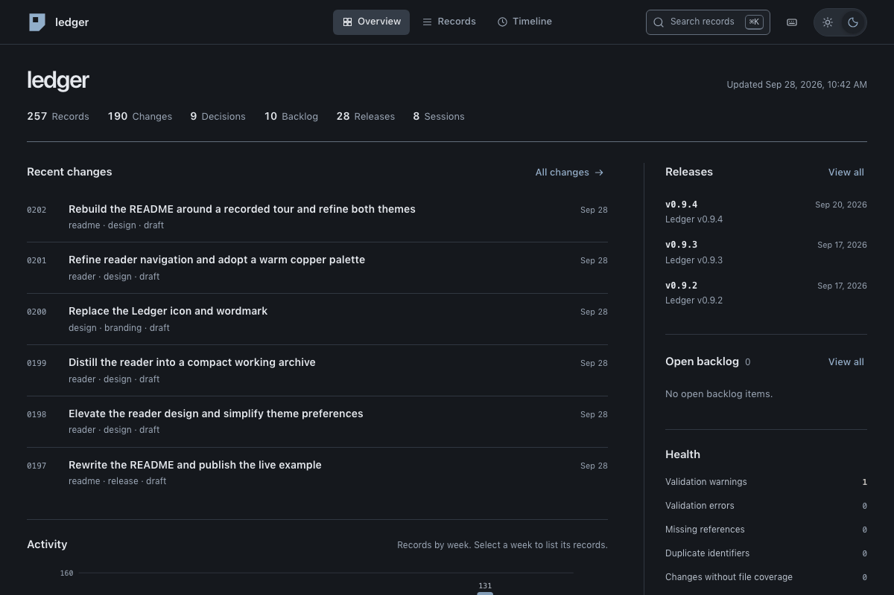
</picture>
</a>

<p align="center">
  Real records. Real interactions. This is Ledger's own project history.<br>
  <a href="./assets/readme/reader-tour.mp4">Watch the full-quality recording</a> ·
  <a href="https://kylebegeman.github.io/ledger/?view=records">Browse the records</a> ·
  <a href="https://kylebegeman.github.io/ledger/changelog/">Read the public changelog</a>
</p>

## Why Ledger

A diff shows that the retry limit changed. A receipt explains why it is five,
which queue timeout depends on it, and the test that proves it still works.
The next person or agent can read that context before touching the file.

- **Carry context between sessions.** Hooks for Claude Code, Codex, and Cursor
  track edited files and draft receipts. The agent finishes the reasoning while
  the work is still fresh.
- **Ask about the code you are changing.** Retrieve history by file, symbol,
  or topic, with invariants and verification inside a token budget.
- **Review the evidence with the change.** Receipts live in the pull request.
  CI checks their structure, file coverage, and docs impact.
- **Own the history.** Plain Markdown under `.ledger/`, committed with your
  code. No account or hosted service required. Your durable guides stay in `docs/`.

## Quick start

Requires **Node 22 or newer**. From the root of an existing Node project:

```bash
npm install --save-dev @kylebegeman/ledger
npx ledger adopt
npx ledger hooks install --host claude-code --command "npx ledger" --import-agents
npx ledger skills install
npx ledger agents --write
```

`adopt` creates `.ledger/`, infers source paths and checks from the tracked
repository, and leaves your hand-written docs in place. For a new project
with a docs scaffold, use `npx ledger init --with-docs` instead.

Start a new agent session and work as usual. Open the growing history with:

```bash
npx ledger serve --watch
```

<details>
<summary><strong>Using Codex or Cursor</strong></summary>

Replace the Claude Code hook command above with the one for your host. You can
install more than one host in the same repository.

```bash
# Codex
npx ledger hooks install --host codex --command "npx ledger" --launcher

# Cursor
npx ledger hooks install --host cursor --command "npx ledger"
```

For Codex, trust the hooks through `/hooks` in the CLI or the Hooks page in
the app's settings, then start Codex at the project root. The generated
launcher keeps the hook command stable across Ledger upgrades.

Claude Code and Codex announce a drafted receipt at the next prompt; Cursor
announces it when the next session starts.

</details>

<details>
<summary><strong>Using Ledger in a Go, Rust, Python, Swift, or other repository</strong></summary>

Run a pinned package through npx. The project itself does not need a
`package.json`; the machine still needs Node.

```bash
npx --yes @kylebegeman/ledger@0.9.5 adopt
npx --yes @kylebegeman/ledger@0.9.5 hooks install --host claude-code --command "npx --yes @kylebegeman/ledger@0.9.5" --import-agents
npx --yes @kylebegeman/ledger@0.9.5 skills install
npx --yes @kylebegeman/ledger@0.9.5 agents --write
npx --yes @kylebegeman/ledger@0.9.5 serve --watch
```

For Codex, use `--host codex --launcher` instead of
`--host claude-code --import-agents`; for Cursor, use `--host cursor`.
Keep the pinned `--command` so every contributor runs the same package.

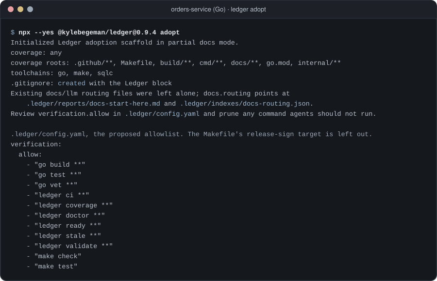

</details>

<details>
<summary><strong>Working without hooks</strong></summary>

Create a receipt from your diff:

```bash
npx ledger new "Add jitter to webhook retries" --from-diff --area billing
```

Open the generated Markdown and fill in the summary, why, changed files,
invariants, verification, and docs impact. Then check it:

```bash
npx ledger ready
npx ledger ci
```

</details>

## How it works

**Read the context. Make the change. Leave a receipt.** The next change starts
with what the previous one learned.

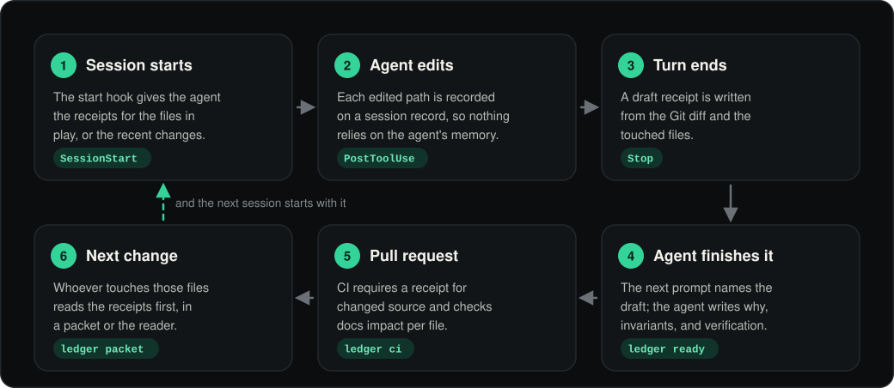

A receipt connects a change to its files, symbols, decisions, and docs. It
records what must stay true and how the work was verified. Hooks draft the
structure from the diff; the agent or author supplies the explanation.

Before editing a file, ask for its context:

```bash
npx ledger packet src/billing/webhooks.ts --budget 1200
```

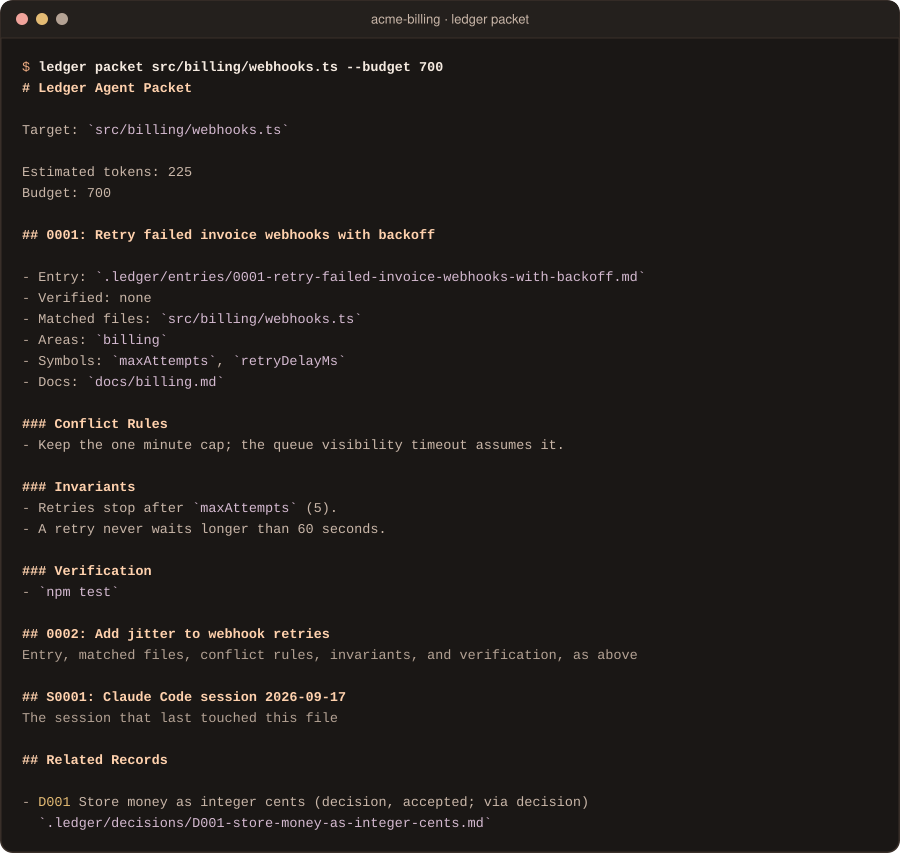

<details>
<summary><strong>See what the agent receives at each step</strong></summary>

At session start, Ledger gives the agent bounded context for files already
changed in the working tree:

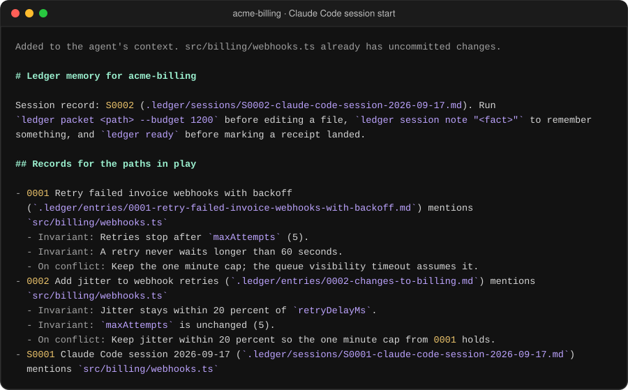

After the turn, the hook drafts a receipt. The next notice names that draft
so the agent finishes it instead of creating a duplicate. Claude Code and
Codex show the notice at the next prompt; Cursor shows it next session.

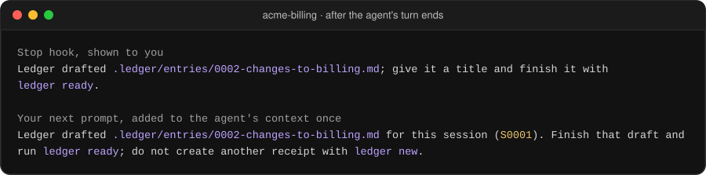

`ledger ready` catches unfinished titles, TODOs, placeholders, and missing
required content. Run it before marking a receipt landed; `ledger ci` does
not run this readiness check.

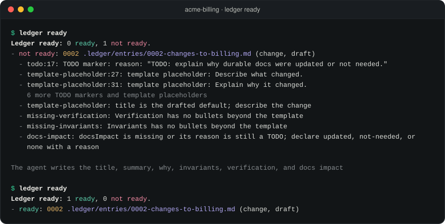

The [architecture guide](./docs/ARCHITECTURE.md) covers hooks, compaction,
session expiry, and verification evidence.

</details>

<details>
<summary><strong>Read a receipt and its Markdown source</strong></summary>

This example comes from the billing demo used to generate the terminal output
above. The same source becomes a readable document with linked evidence:

<p align="center">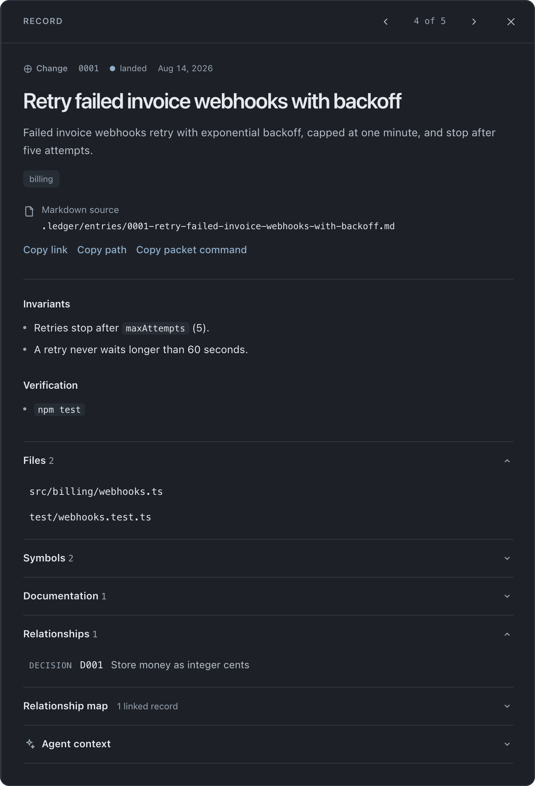</p>

```markdown
---
id: "0001"
kind: "change"
title: "Retry failed invoice webhooks with backoff"
date: "2026-08-14"
updated: "2026-08-14"
status: "landed"
areas:
  - "billing"
files:
  - "src/billing/webhooks.ts"
  - "test/webhooks.test.ts"
symbols:
  - "maxAttempts"
  - "retryDelayMs"
docs:
  - "docs/billing.md"
docsImpact:
  status: "updated"
  reason: "The billing doc explains webhook retries."
  docs:
    - "docs/billing.md"
decisions:
  - "D001"
---

# 0001: Retry Failed Invoice Webhooks With Backoff

## Summary

Failed invoice webhooks retry with exponential backoff, capped at one minute,
and stop after five attempts.

## Why

Customers missed invoice events when their endpoint restarted during a deploy.

## Changed Files

### src/billing/webhooks.ts

- What changed: `maxAttempts` and `retryDelayMs` schedule the retries.
- Anchor: `retryDelayMs`
- On conflict: Keep the one minute cap; the queue visibility timeout assumes it.

### test/webhooks.test.ts

- What changed: pins the attempt limit and the cap.
- Anchor: `caps retries`
- On conflict: Update the test only with a receipt that changes the limit.

## Behavior And UX Impact

Transient delivery failures retry automatically, up to five attempts.

## Invariants

- Retries stop after `maxAttempts` (5).
- A retry never waits longer than 60 seconds.

## Verification

- `npm test`

## Notes

The queue visibility timeout is 90 seconds.
```

</details>

## The reader

Move from the shape of a project to the evidence behind a single change.

| View | What you can do |
| --- | --- |
| **[Overview](https://kylebegeman.github.io/ledger/)** | Catch up on recent changes, activity, releases, open work, and health signals. Select a count or chart bar to explore its records. |
| **[Records](https://kylebegeman.github.io/ledger/?view=records)** | Search and filter by type, status, area, release, tag, or quality signal. Open a receipt beside the list and step through the results. |
| **[Timeline](https://kylebegeman.github.io/ledger/?view=timeline)** | Read the project's history in month groups, with the same search and filters. |

<a href="https://kylebegeman.github.io/ledger/?view=records&record=0133">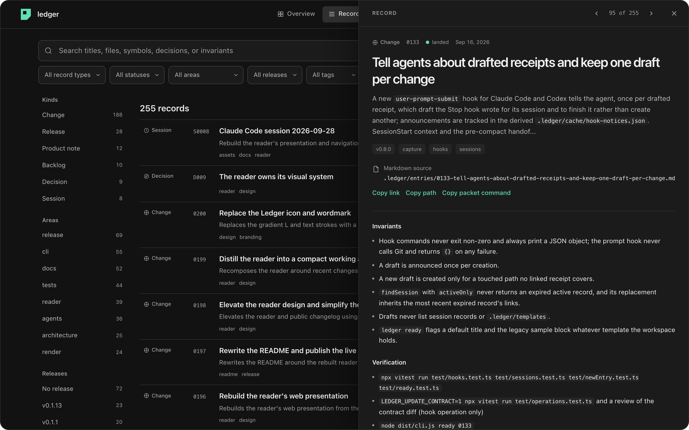</a>

Follow a file or symbol to every record that names it. Open linked decisions
and backlinks, expand the relationship map, or copy a record link and its
`ledger packet` command. The command palette finds records, files, symbols,
and areas without leaving the keyboard.

**Keyboard:** `/` search · `⌘K` / `Ctrl+K` palette · `j` / `k` move ·
`o` open · `[` / `]` previous / next · `?` all shortcuts.

<details>
<summary><strong>Still views: overview, timeline, and command palette</strong></summary>

The theme follows your system until you choose Light or Dark. Your choice
persists across visits.

<picture>
  <source media="(prefers-color-scheme: dark)" srcset="./assets/readme/overview.png">
  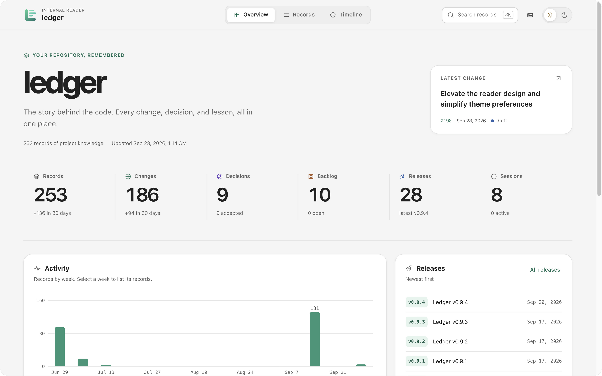
</picture>

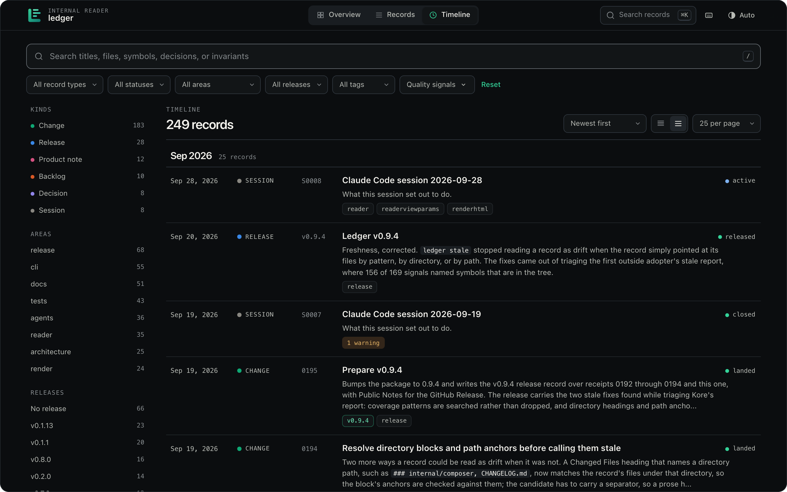

<p align="center">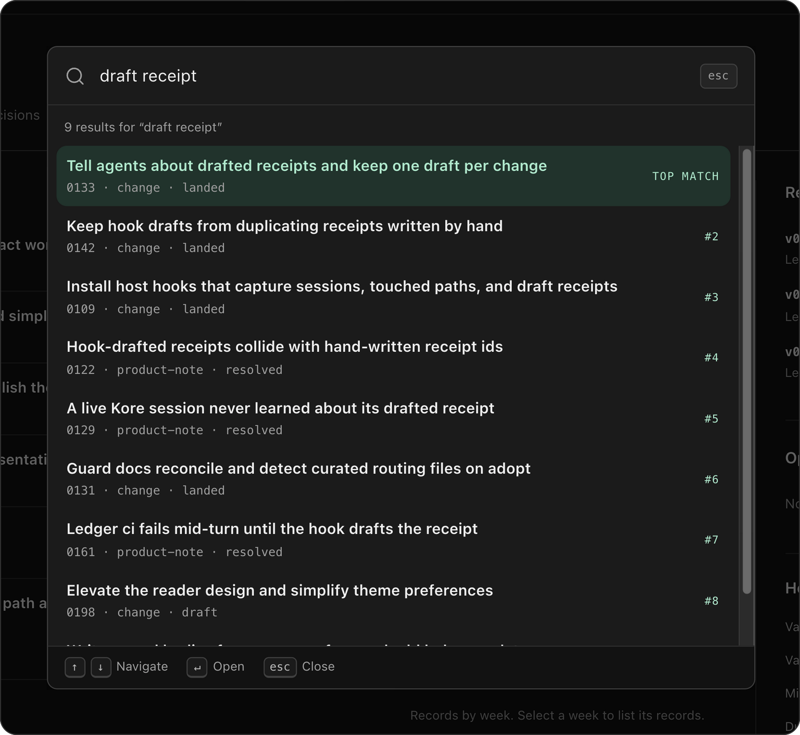</p>

</details>

### Share the history

```bash
npx ledger render                    # static reader in .ledger/dist/
npx ledger serve --watch              # local reader, rebuilt as records change
npx ledger render --profile public    # released versions and their Public Notes
```

The reader loads no external fonts or scripts. Host the generated directory
on any static server. Small catalogs also work directly from disk; HTTP
enables ranked search and loads detail chunks for larger catalogs.

The **[public changelog](https://kylebegeman.github.io/ledger/changelog/)**
includes release permalinks and an Atom feed. It contains only released
versions and their Public Notes, with internal paths, symbols, and invariants
removed. The full reader includes the repository's internal records.

<a href="https://kylebegeman.github.io/ledger/changelog/">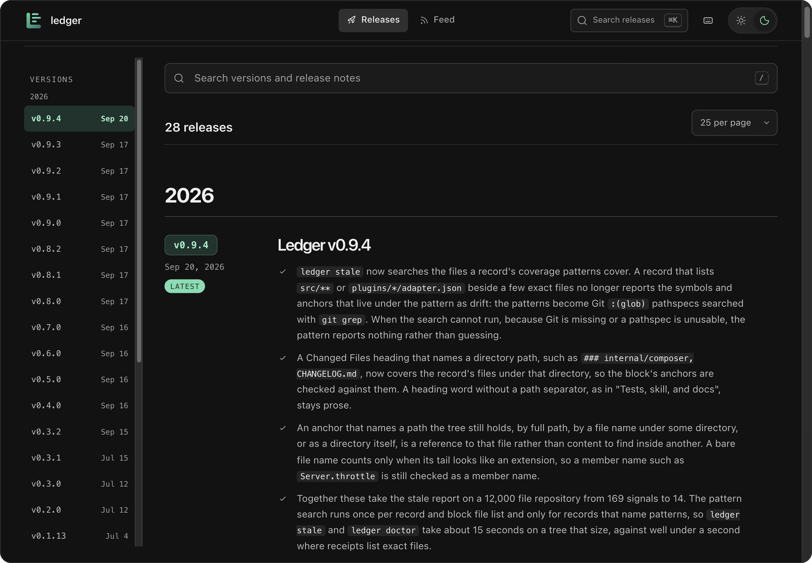</a>

The [publishing guide](./docs/PUBLISHING.md) includes GitHub Pages workflows
and explains `--site-url`. This repository's example is rebuilt from `master`.

## In CI

Check the history alongside the code. The action validates records, audits
docs, and checks receipt coverage and docs impact for the pull request.

```yaml
name: ledger
on: pull_request
jobs:
  ledger:
    runs-on: ubuntu-latest
    permissions:
      contents: read
    steps:
      - uses: actions/checkout@v7
        with:
          fetch-depth: 0
      - uses: kylebegeman/ledger@v0.9.5
        with:
          command: npx --yes @kylebegeman/ledger@0.9.5
```

Coverage checks configured paths. With `git.coverage: current`, a changed
source file needs a receipt in the same change set. `adopt` starts with `any`,
which accepts an earlier receipt naming that file, so you can adopt Ledger
incrementally. Review the inferred paths and verification allowlist in
`.ledger/config.yaml`.

<details>
<summary><strong>See a failing check and enable a PR summary comment</strong></summary>

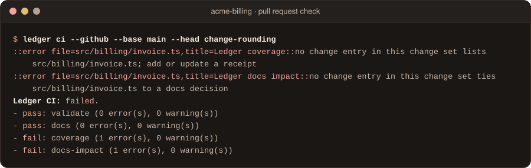

Add `comment: "true"` to the action's inputs and `pull-requests: write` to
the job's permissions for one summary comment updated on each run. Fork
pull requests whose tokens cannot write get a notice instead.

</details>

## For agents and tools

The CLI, library, engine API, and MCP server share the same operations.
Start with a focused query instead of loading the whole catalog:

| Task | Command |
| --- | --- |
| Understand a file | `ledger packet src/billing/webhooks.ts --budget 1200` |
| Find context by topic | `ledger search-packet "webhook retries" --budget 1600` |
| Review a change set | `ledger context --base origin/master --head HEAD` |
| Resolve a conflict | `ledger conflict src/billing/webhooks.ts` |
| Find stale references | `ledger stale --check` |
| Record verification evidence | `ledger verify --run` |

Use your configured Ledger command, such as `npx ledger`, for the examples
above. Retrieval and check commands accept `--json` for structured results.

- **MCP:** `ledger mcp` over stdio, or `/mcp` on `ledger serve --api`.
  Clients confirm record-writing tools before they write.
- **Local engine:** `ledger serve --api` adds a JSON API, live events, and
  browser reloads when records change.
- **TypeScript:** import library operations or `connectLedgerClient` from
  `@kylebegeman/ledger`. The [API guide](./docs/API.md) covers the typed client
  and stability rules.

## Documentation

| Start here | Go deeper |
| --- | --- |
| [Product](./docs/PRODUCT.md): purpose and workflows | [Architecture](./docs/ARCHITECTURE.md): hooks, engine, cache, and reader |
| [Command reference](./docs/COMMANDS.md): usage and flags | [API](./docs/API.md): library and typed engine client |
| [Schema](./docs/SCHEMA.md): records and configuration | [Docs relationship](./docs/DOCS_RELATIONSHIP.md): what stays in `docs/` |
| [Publishing](./docs/PUBLISHING.md): reader, changelog, and feed | [Security](./SECURITY.md): reporting issues and server exposure |
| [Contributing](./CONTRIBUTING.md): development and visual assets | [Roadmap](./docs/ROADMAP.md): planned work |

Change entries, decisions, backlog items, product notes, releases, and session
records all live in `.ledger/`. Commit those sources with your code;
indexes, caches, reports, and the reader are derived. Verification evidence
in `.ledger/reports/evidence.json` is committed too.

To work on Ledger itself:

```bash
npm ci
npm run ci
```

This repository uses Ledger to document its own development. Browse the
[receipts](./.ledger/entries), read the [release process](./docs/RELEASE_PREP.md),
or open the [live example](https://kylebegeman.github.io/ledger/).

<p align="center"><a href="./LICENSE">MIT licensed</a> · Markdown in your repository. Context for the next change.</p>
